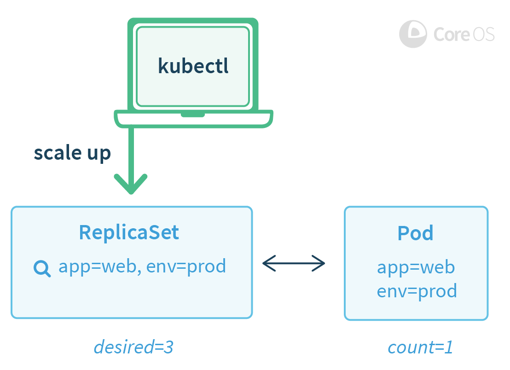
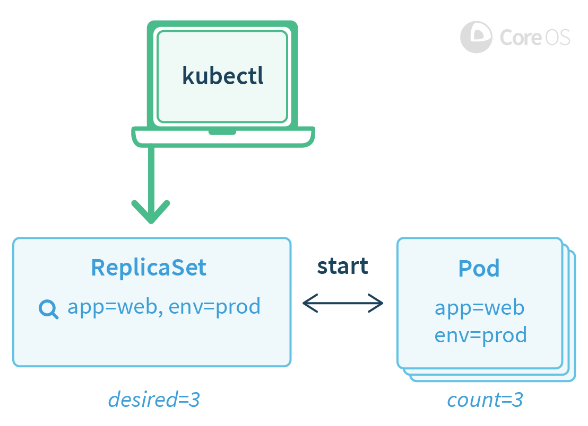
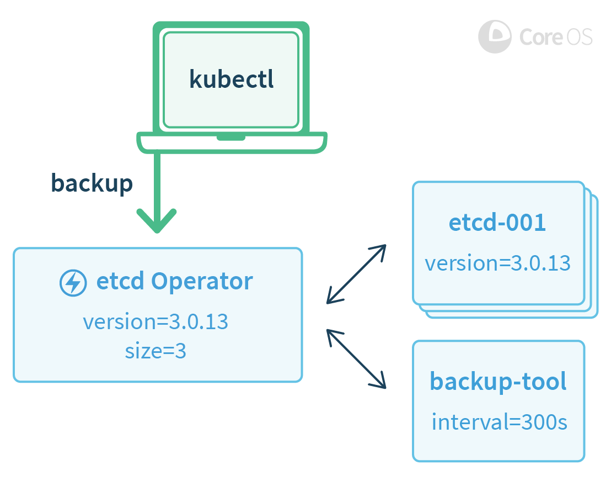

# Operator介绍： 将Operator应用到软件

站点可靠性工程师（SRE）是通过编写软件来管理应用程序的人员。他们是工程师，开发人员，知道如何专门为特定应用领域开发软件。 由此产生将应用程序的运行的领域知识编入对应的软件（简单的说就是，产生了一个专门针对软件运行管理的软件领域，即 Operator ）。

我们的团队一直忙于Kubernetes社区设计和实现这一理念：在Kubernetes上可靠地创建，配置和管理复杂的应用程序实例。

我们将这类新的软件称为Operator。Operator是一个特定于应用程序的控制器，通过扩展Kubernetes API去创建，配置和管理复杂有状态应用程序的实例。它是基于Kubernetes资源和控制器的基础上，并且包含了通过编写应用程序实现自动执行特定应用程序的常见任务的相关知识。    

## 无状态容易，有状态难    

使用Kubernetes，开箱即用地管理和扩展Web应用程序，移动后端和API服务相对容易。为什么？因为这些应用通常都是无状态的。因此基本的Kubernetes API（如Deployments）就可以将无状态应用扩展和从故障中恢复。    

一个更大的挑战是管理有状态的应用程序，像数据库，缓存和监控系统。这些系统需要应用领域的知识才能正确扩展，升级和重新配置，从而防止数据丢失或不可用。我们希望将这种应用特定的操作知识编写到软件中，其可以使用利用强大的Kubernetes抽象能力，达到正确运行和管理应用程序的目的。    

Operator是一种软件，它结合了特定的领域知识并通过third party resources（译：当前为 CRD）机制扩展了Kubernetes API，使用户像管理 Kubernetes 的内置资源一样创建，配置和管理应用程序。Operator 管理整个集群中的多个实例，而不仅仅管理应用程序的单个实例。    

    

为了用实际运行代码演示 Operator 概念，今天我们宣布两个具体的开源项目：    

[etcd Operator](https://coreos.com/blog/introducing-the-etcd-operator.html) 创建，配置和管理 etcd 群集。 etcd 是由 CoreOS 引入的可靠的分布式键值存储，用于维护分布式系统中的最关键数据，并且是 Kubernetes 本身的主要配置数据存储。    
[Prometheus Operator](https://coreos.com/blog/the-prometheus-operator.html) 创建，配置和管理 Prometheus 监控实例。 Prometheus 是一个强大的监控，指标和告警工具，由 CoreOS 团队支持的云本机计算基金会（CNCF）中的项目。    

## 如何构建Operator    

Operators基于Kubernetes的两个核心概念：资源和控制器。 例如内置的ReplicaSet资源允许用户设置运行所需Pod的数量，并且Kubernetes内的Controllers通过创建或删除正在运行的Pod来确保在ReplicaSet资源中设置预期的状态。Kubernetes中有许多以这种方式工作的基本控制器和资源，包括Services, Deployments, 和 DaemonSets。    

    

例 1a: 运行的单个 Pod，用户修改期望运行的Pod数目为3    

    

例 1b: 一段时间后，Kubernetes内部的controllers创建了新的Pod以满足用户请求.    

Operator是基于Kubernetes的resource和controller这两核心上，并且增加了一组允许Operator执行常见的应用任务的知识或配置。例如手动扩展一个etcd集群时，用户必须执行多个步骤：为新的etcd成员创建一个DNS名称，启动新的etcd实例，然后使用etcd管理工具（etcdctl member add）告诉现有集群关于这个新成员。 而使用etcd Operator，用户可以简单地将etcd集群扩1。    

    

例 2: 用户使用kubectl触发备份操作    
Operator可能处理的复杂管理任务的其他示例包括应用程序升级的安全协调，备份到异地存储的配置，通过Kubernetes API的服务发现，应用程序TLS证书配置和故障恢复。    

## 如何创建 Operator？    

Operators本质上是特定于应用程序的，所以最复杂的工作是将应用程序操作领域知识编码到合理的配置资源和控制循环中。在创建Operator时，有以下一些常见的模式：    

1. Operators应采用deployment等方式进行安装，例如 kubectl create -f https://coreos.com/operators/etcd/latest/deployment.yaml，并在安装后不需要再执行其他操作。
2. Operators 在安装到 Kubernetes 时应创建一个新的第三方类型。用户使用此类型创建新的应用程序实例。
3. Operators 应尽可能利用内置的 Kubernetes 原语，如Services和ReplicaSets，且经过良好测试和易于理解的代码。
4. Operators应该向后兼容，使得用户可以创建以前版本的资源。
5. Operators应被设计成即使Operators停止或删除时，应用程序实例不受影响。
6. Operators应该让用户能够根据声明的期望版本进行应用程序升级。不进行软件升级是操作错误和安全问题的常见来源，Operators可以帮助用户更加方便地解决这一问题。
7. Operators应该采用“混沌猴”测试套件进行测试，以模拟Pod，配置和网络的潜在故障。    

## Operators的前景    
今天由CoreOS推出的etcd Operator和Prometheus Operator展示了Kubernetes平台的强大功能。 去年，我们更广泛地与Kubernetes社区合作，致力于使Kubernetes更加稳定，安全，易于管理和快速安装。    

现在，Kubernetes的基础已经奠定，我们的新焦点是在其之上构建系统：使用新功能扩展Kubernetes。 我们设想用户在他们的Kubernetes集群上安装Postgres Operators，Cassandra Operators或 Redis Operators，并且可以轻松地部署这些程序的可伸缩实例，就像今天部署无状态Web应用程序一样。    

想了解更多信息，请参阅GitHub仓库，在我们的[community](https://coreos.com/community/)频道中进行讨论，或于11月8日星期二在 [KubeCon](https://coreos.com/blog/kubecon-preview.html)与CoreOS团队交谈。请不要错过在[11月8日星期二下午5点25分我的主题演讲](https://cnkc16.sched.org/event/8g4I)，我将介绍 Operators和其他Kubernetes主题。    

## FAQ    

Q：这与StatefulSets（以前的PetSets）有什么不同？    
A：StatefulSets旨在支持Kubernetes中的应用程序，这些应用程序需要群集为其提供"有状态资源"，如静态IP和存储。需要这种更有状态的部署模型的应用程序仍然需要Operator自动化来告警并对故障，备份或重新配置采取行动。 因此需要这些部署属性的应用程序的Operators可以使用 StatefulSets，而不是利用ReplicaSets或Deployments。    

Q：这与 Puppet 或 Chef 等配置管理有何不同？    
A: Containers和Kubernetes是使Operators与他们有了巨大差异。使用Kubernetes API，部署新软件，协调分布式配置以及检查多主机系统状态是一致且容易的。Operators这些原语粘贴在一起，为应用程序使用者提供有用的方式；它不仅仅是配置，而是整个应用状态。    

Q: 这与 Helm 有什么不同？    
A: Helm是一个将多个Kubernetes资源打包到一个包中的工具。 将多个应用程序打包在一起并使用主动管理应用程序的Operator是相辅相成的概念。 例如,traefik是一个可以使用etcd作为其后端数据库的负载平衡器。 您可以创建一个Helm Chart，将 traefik Deployment和etcd集群实例一起部署。 etcd 集群将由etcd Operator部署和管理。    

Q: 如果是 Kubernetes新手？ 该如何学习？    
A: 这不应该改变新用户的任何内容，除非让他们更容易在将来部署诸如etcd,Prometheus等的复杂应用程序。 我们推荐的Kubernetes入门路径仍然是minikube，kubectl run，然后可能会开始与 Prometheus Operator一起玩，以监控您使用kubectl run 部署的应用程序。    

Q: 今天是否可以为etcd Operator和Prometheus Operator提供源码地址？        
A: 当然，它们可以在GitHub上找到，[网址是https://github.com/coreos/etcd-operator](https://github.com/coreos/etcd-operator)和[https://github.com/coreos/prometheus-operator。](https://github.com/coreos/prometheus-operator)      

Q: 你有其他Operator的计划吗？    
A: 是的，这很可能在未来。我们也希望看到社区创建新的Operator。让我们知道您希望接下来构建的其他Operator。     

Q: Operators 如何确保群集安全？     
A: 不升级软件是操作错误和安全问题的常见来源，Operator 可以帮助用户更加自信地解决执行正确升级的难题。    

Q: Operators可以灾备恢复吗？    
A: Operators 可以轻松定期备份应用程序状态并从备份中恢复以前的状态。 我们希望 Operators 能够普遍使用这一项功能可以让用户轻松地从备份中部署新实例。

## 引用：    
[原文](https://coreos.com/blog/introducing-operators.html)       
[Operators 介绍](https://www.do1618.com/archives/1255/operators-介绍/)
